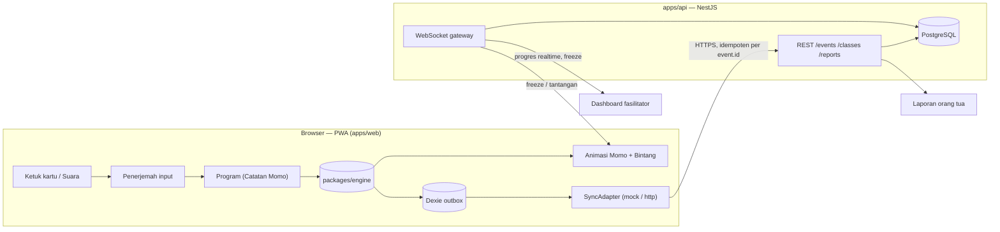

# Arsitektur Little Coder

Status: M1 + M3+ · Stack: Node.js + React + NestJS + PostgreSQL (lihat [decisions.md](decisions.md) D-001).

## Gambaran besar



Server bisa jalan di cloud atau di laptop fasilitator (router sendiri) untuk venue tanpa internet —
arsitekturnya sama, hanya `VITE_API_URL` yang berbeda.

## Paket

### `packages/engine` — otak, TypeScript murni

Tidak boleh bergantung pada React, DOM, NestJS, atau IO (dijaga ESLint). Dipakai oleh web (bermain,
offline), api (validasi event, reducer progres), dan `scripts/validate-content.ts`.

| Modul          | Isi                                                                                           | Milestone   |
| -------------- | --------------------------------------------------------------------------------------------- | ----------- |
| `program/`     | Tipe `Instr`/`Program` (A5), penerjemah input → program                                       | M0 tipe, M1 |
| `interpreter/` | `run(level, program) => Trace`, deterministik, ≤ 200 langkah                                  | M1          |
| `levels/`      | Skema Zod level (dasar di M0, per `type` di M1), evaluator per jenis puzzle                   | M0–M1       |
| `solver/`      | BFS `{pos, facing, collected}`; iterative deepening untuk `repeat`/`if`; deteksi jalan pintas | M1          |
| `scoring/`     | Bintang level (A8), Skor Jago `jago.ts` (A9)                                                  | M1, M3      |
| `generator/`   | Soal dari skill template, RNG ber-seed, evaluator ekspresi aman (tanpa `eval`)                | M3          |
| `adaptive/`    | Bantuan bertahap (2×/3×/5×), lompat maju, rekomendasi 3 skill                                 | M1, M3      |
| `events/`      | Tipe & skema event (A11), reducer progres, aturan merge konflik                               | M4          |
| `content/`     | Skema file dialog Momo                                                                        | M0          |

Format: ESM. Export condition `source` → web/vitest/tsx memakai `src/*.ts` langsung; api memakai `dist/`.

### `apps/web` — satu app, tiga area

| Rute              | Pengguna          | Catatan                                                                                      |
| ----------------- | ----------------- | -------------------------------------------------------------------------------------------- |
| `/play`           | Anak              | Masuk (kode/QR → warna Momo → nama panggilan), Kota Momo, pemutar level, Pustaka, Kamar Momo |
| `/fasilitator`    | Kakak fasilitator | Login magic link, buat kelas + QR, dashboard realtime, bekukan layar, tantangan kelas        |
| `/laporan/:token` | Orang tua         | Ringkasan, replay perjalanan Momo, sertifikat PDF (`pdf-lib`, di client)                     |

Folder: `play/`, `facilitator/`, `report/`, `components/` (`<Momo mood>`, `KartuBesar`, `Grid`, `TombolSuara`),
`audio/` (Howler + fallback `speechSynthesis` id-ID), `sync/` (SyncAdapter + outbox), `i18n/`, `config/`.

State: Zustand, satu store kecil per fitur. Persistensi lokal: Dexie (`outbox`, `progress`, `skillState`).

### `apps/api` — NestJS

| Modul / controller                       | Tanggung jawab                                                                                                                                                                                                                   |
| ---------------------------------------- | -------------------------------------------------------------------------------------------------------------------------------------------------------------------------------------------------------------------------------- |
| `DbModule`                               | Pool `pg` + Drizzle (global)                                                                                                                                                                                                     |
| `AuthModule`                             | Login staf & orang tua (email + password, scrypt), daftar orang tua (wajib persetujuan), masuk anak (kode keluarga + sandi gambar, kunci 1 menit setelah 5× salah), JWT, guard global `@Public()` / `@Roles()`, rate limit login |
| `CatalogController`                      | `GET /catalog` (katalog + skill aktif), `GET /levels` — untuk semua yang login                                                                                                                                                   |
| `PracticeController` (anak)              | `GET /practice/state`, `POST /practice/sync` — idempoten per `event.id`, merge Skor Jago                                                                                                                                         |
| `ParentController` (orang tua)           | profil anak (nama panggilan + warna + sandi gambar), hapus profil (UU PDP), laporan                                                                                                                                              |
| `ClassesController` (admin, fasilitator) | kelas workshop + kode; fasilitator hanya kelasnya                                                                                                                                                                                |
| `Admin*Controller` (admin)               | skill & soal (validasi 200 soal sebelum simpan, versi otomatis), katalog, level (validasi solver), staf, orang tua, anak, laporan & analisis pengecoh                                                                            |
| `ReportsService`                         | laporan anak (per kategori, skor penguasaan area, 3 rekomendasi), ringkasan admin, statistik skill                                                                                                                               |
| `scripts/seed.ts`                        | isi DB dari `content/` + admin pertama                                                                                                                                                                                           |

Realtime (Socket.IO, M5) dan `EventsModule` umum (M4) menyusul. Test: Vitest + `unplugin-swc` +
`supertest`; e2e memakai Postgres sungguhan (`DATABASE_URL_TEST`, di CI lewat service container).

## Data

Skema di [`apps/api/src/db/schema.ts`](../apps/api/src/db/schema.ts), migrasi di `apps/api/drizzle/`.

```text
staff_users (admin | facilitator) ─< classes ─< children
parents (email, family_code, consent_at) ─< children (nickname, momo_color, picture_pin_hash)
children ─┬─ parent_contacts (anak kelas tanpa akun, wajib consent_at)
          ├─< events          (append-only, PK = id dari client; item_answer, …)
          ├─< level_progress  (PK child + level_id + level_version)
          └─< skill_mastery   (PK child + skill_id; state Skor Jago jsonb + hitungan jawaban)
skill_catalogs (domain + grade → kategori)   skills (template jsonb, versi)   levels (data jsonb, versi)
```

- **Privasi:** `children` hanya `nickname` + `momo_color` + hash sandi gambar. Tanpa foto/email/tgl
  lahir/suara. Orang tua bisa menghapus profil anak beserta semua progresnya.
- **Konten:** `content/` = seed + sumber validasi CI; database = versi yang dikelola admin. Mengubah skill
  atau level menaikkan `version`, sehingga progres dan soal lama tetap bisa ditelusuri.

## Offline & sinkronisasi

1. Setiap aksi → event (uuid v4 dibuat di client) → Dexie `outbox`.
2. `SyncAdapter.flush()` saat online, batch, retry exponential backoff; hapus dari outbox hanya setelah ack.
3. Server: `insert … on conflict (id) do nothing` → kirim ganda aman.
4. Merge: bintang = `max`, `visibleStage` = `max`, Skor Jago = state dengan `ts` terbaru.
5. PWA (Workbox) precache semua aset + konten Basic (< 15 MB). Tanpa jaringan, level & Pustaka tetap jalan;
   tombol mikrofon disembunyikan.

`SyncAdapter` punya dua implementasi: `mock` (lokal saja, untuk dev/offline penuh) dan `http` (NestJS).

## Konten & validator

`content/` berisi JSON; `pnpm validate:content` (CI) menjalankan: skema Zod → solver (bisa diselesaikan
dalam `maxCards`, `optimalSteps` auto → `content/.generated/optimal.json`) → deteksi jalan pintas skill `loop`
→ komposisi 4/3/3 per dunia → audioKey ada → tiap skill template menghasilkan 200 soal valid.
